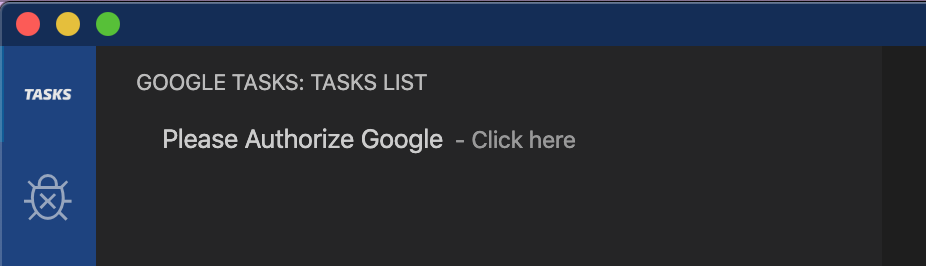

# Google Tasks for VSCode (unofficial)

## Manage your To-Do list ✅ without going out of your VSCode Editor 🤖.

> This is **not** similar to extensions like 🌳 [Todo Tree](https://marketplace.visualstudio.com/items?itemName=Gruntfuggly.todo-tree), which shows a tree view of the //TODO: comments in the source code

> This is not an official product of Google

This extension is for viewing your list of tasks from the [Google Tasks](https://support.google.com/tasks/answer/7675772) in the tree view of VSCode.

## Requirements

You need to have a Google Account with data in Google Tasks application to utilise this extension.

## Screenshots

## Privacy Policy

This extension accesses the user data only during the runtime of VSCode application. User data means only the data that is created by the user within the Google Tasks application. The accessed user data is directly displayed within the VSCode Editor. Also, this data is not persisted in any medium and is not sent or shared to any server or any 3rd party application

## Known Issues

- Not able to logout 🚪🏃

## Release Notes

### 0.1.0

🤞Initial release of google-tasks extension with read only list of Google Tasks

**Enjoy!**
